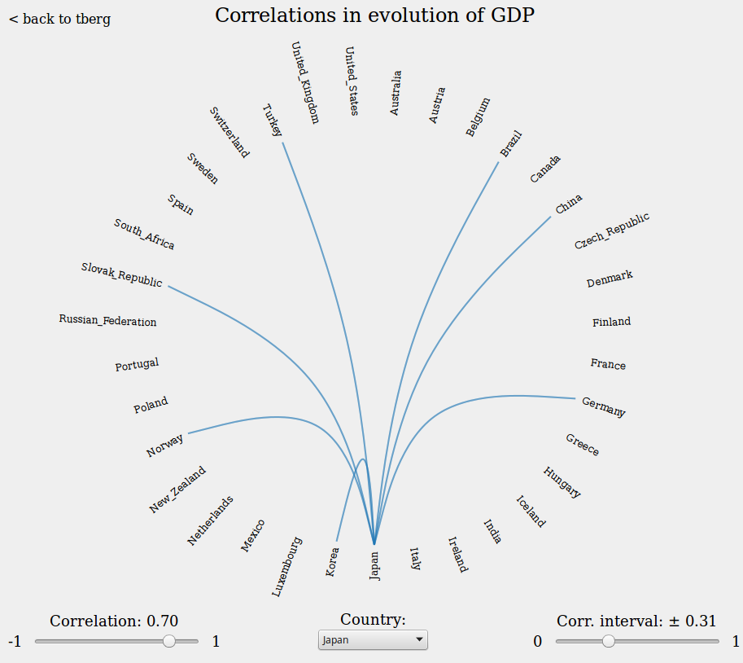

GDP correlations
================
See visualization [here](http://tberg.dk/GDP-correlations/). Made for this [blog post](http://tberg.dk/post/GDP-correlations). Adapted from [this](http://mbostock.github.io/d3/talk/20111116/bundle.html) d3js example.

GDP DATA sources
----------------
- [OECD](http://www.oecd.org/publications/factbook/36340786.pdf)
- [World](http://www.ers.usda.gov/datafiles/International_Macroeconomic_Data/Historical_Data_Files/HistoricalRealGDPValues.xls)

Inspiration
-----------
I got the inspiration to do this visualization from a chapter in the book
[Econophysics - Background and Applications in Economics, Finance, and Sociophysics](https://www.goodreads.com/book/show/16585563-econophysics).

Screenshot
----------

